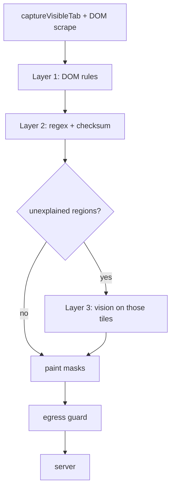

# Aegis — Redaction Pipeline

How the client decides what to hide, hides it, and proves nothing leaked.

Scope: SIH26171, client side. The server contract is at the end. Written 31 August 2026,
against the Round 4 prototype deadline of 2 September 2026, 10:00.

---

## 0. The server model constraint — read this before picking an API

**The frontier model cannot be OpenAI, Anthropic or Gemini.** The problem statement says:

> Any offline-deployable (open-source / open-weights) model may be used server-side; a
> cloud-hosted version of it is acceptable during SIH.

Two conditions, and both must hold. The model has to be one you *could* run offline — i.e.
open weights — and only then is a hosted copy allowed as a convenience during the event.
GPT-4o, Claude and Gemini fail the first condition, so they are out regardless of how they
are called. Slide 4 of the submitted deck already commits us to "open-weights Qwen2.5-VL
class", so using a closed model would also contradict our own submission.

**What this permits, which is more than it first sounds:** take an open-weights VLM and call
it over HTTP from a hosted provider. The weights are downloadable, so the offline-deployable
test passes; the hosting is the acceptable convenience.

| | Allowed | Why |
|---|---|---|
| Qwen2.5-VL-7B/32B/72B-Instruct via Together / OpenRouter / Fireworks / Hyperbolic | yes | Apache-2.0 weights, hosted copy |
| Same model via local vLLM or Ollama | yes | the ideal end state |
| Pixtral, InternVL, Molmo, Llama 3.2 Vision | yes | open weights |
| GPT-4o / Claude / Gemini | **no** | weights are not obtainable at any price |

Recommended: **Qwen2.5-VL-Instruct**. Apache-2.0, widely hosted, and trained for GUI
grounding — it can point at UI elements, which is exactly the action-generation job. Most
providers expose an OpenAI-compatible endpoint, so the client code is the same shape either
way; only the `baseURL` and model string change. Keep those in server env vars so swapping
provider is a one-line change if one is slow on demo day.

---

## 1. Model inventory

What actually ships. Note how little of this is a model — that is the design, not an
accident.

### Client, in the browser

| Layer | Artifact | Size | Licence | Role |
|---|---|---|---|---|
| DOM rules | none | 0 | — | password fields, autocomplete tokens, ARIA roles |
| Regex + checksum | none | 0 | — | Aadhaar, PAN, GSTIN, IFSC, card, phone, email |
| Face detection | `pollen-robotics/face_detection_yunet_2023mar` | **0.23 MB** | MIT | face boxes |
| QR / barcode | `jsQR` (algorithm, not a model) | ~30 KB | Apache-2.0 | QR payloads |
| Visual PII *(deferred)* | `screenpipe/pii-image-redactor` (RF-DETR) | 109 MB?† | **CC BY-NC 4.0** | PII regions DOM cannot explain |

† `../../ner-redaction-models.csv` reports 875 MB for the whole repo; `shortlisted.md`
records 109 MB for the ONNX file. The repo probably carries fp32/fp16/int8 variants. Verify
the individual file size before assuming it is shippable.

Face model alternatives, all ONNX and none AGPL, from `../../face-detection-models.csv`:

| Model | Size | Licence |
|---|---|---|
| `opencv/face_detection_yunet` | 0.10 MB | blank in CSV — confirm before use |
| `pollen-robotics/face_detection_yunet_2023mar` | 0.23 MB | mit ← **use this one** |
| `fernandotonon/QtMeshEditor-blazeface-onnx` | 0.42 MB | apache-2.0 |
| `amd/retinaface` | 1.77 MB | apache-2.0 |
| `RuteNL/SCRFD-face-detection-ONNX` | 2.30 MB | apache-2.0 |

Take the MIT YuNet mirror over the 0.10 MB OpenCV entry: 130 KB is not worth an unverified
licence field. **Avoid every YOLO-family face model in that CSV** — the `agpl_runtime`
column marks them, and AGPL makes the extension undistributable afterwards.

### Server

| Artifact | Licence | Role |
|---|---|---|
| Qwen2.5-VL-Instruct (hosted or local) | Apache-2.0 | reads sanitized image + manifest, emits typed actions |

### Deliberately not used

- **Text NER.** All 707 rows of `ner-redaction-models.csv` stay on the bench. Ten to fifteen
  forward passes over a content-heavy page costs more than one vision pass, and regex with a
  checksum beats a model outright on structured Indian IDs. If this is ever revisited, the
  only browser-viable candidate in the sheet is `gravitee-io/bert-small-pii-detection`
  (29M params, 114 MB, ONNX, Apache-2.0).
- **OCR.** Tesseract.js is heavy and slow, and we do not need it: **redaction requires
  locating text, not reading it.** The `kind` label in the manifest comes from the DOM and
  regex layers, which already know what they matched. Adding OCR would buy a worse label at
  a much higher cost.

---

## 2. The cascade

Cheapest and most certain first. Every layer marks the regions it claims, and later layers
skip explained ground. That gating is what keeps the tile count — and therefore latency and
battery — down.



### Layer 1 — DOM rules · no model · ~0 ms

Certain by construction. If the page says it is a password field, it is one.

- `input[type=password]` — unconditional.
- `autocomplete` tokens: `current-password`, `new-password`, `cc-number`, `cc-csc`,
  `cc-exp`, `one-time-code`, `tel`, `email`, `street-address`, `postal-code`, `bday`, `sex`.
- `input[type=email]`, `input[type=tel]`.
- ARIA: `role="textbox"` or `aria-label` matching sensitive terms.
- `contenteditable` regions, which behave like inputs but match none of the above.

Emit `kind` directly from whichever rule fired. This is the only layer whose labels are
fully trustworthy.

### Layer 2 — regex + checksum · no model · ~0 ms

Checksums are the point. A bare twelve-digit pattern fires on order numbers, timestamps and
tracking IDs; Verhoeff cuts that to near zero. Redaction precision is 20% of the rubric, so
the checksum is worth marks directly.

| Kind | Pattern | Validator |
|---|---|---|
| `aadhaar` | `[2-9]\d{3}\s?\d{4}\s?\d{4}` | **Verhoeff** — mandatory |
| `pan` | `[A-Z]{5}[0-9]{4}[A-Z]` | structural (4th char = entity type) |
| `gstin` | `\d{2}[A-Z]{5}\d{4}[A-Z][A-Z\d]Z[A-Z\d]` | embeds a valid PAN |
| `ifsc` | `[A-Z]{4}0[A-Z0-9]{6}` | 5th char is always `0` |
| `card` | `\d{13,19}` with separators | **Luhn** |
| `phone` | `(\+91[\-\s]?)?[6-9]\d{9}` | leading digit 6–9 |
| `email` | standard | — |

Handling Indian formats properly is also a visible differentiator: a detector trained on
synthetic US English data will fumble all of these.

**Do not redact the whole element.** Wrap the matched substring in a `Range` and call
`getClientRects()`, so "Your PAN is ABCDE1234F" loses six characters, not the sentence. The
surrounding text is the visual context the server needs, and that is 25% of the rubric.

### Layer 3 — vision · ONNX Runtime Web · the entire compute budget

Runs only on regions layers 1 and 2 could not explain.

- **Round 4 scope: faces only**, via YuNet at 0.23 MB. This is deliberately small. It
  discharges the gap we declared on slide 2 of the deck — "none of us has shipped in-browser
  inference on WebGPU or ONNX Runtime Web yet" — at a few hours' cost, and proves the
  execution path end to end.
- **After Round 4:** the tiled PII detector. A 512×512 input against a 1920×1080 viewport
  downscales 3.75×, which makes 12px body text invisible, so full coverage means tiling —
  6–8 passes per screen. Gating on already-explained regions is what keeps that affordable.
- QR codes go through `jsQR`, which is an algorithm rather than a model and costs nothing.

**Treat the detector as a localizer, not a classifier.** The screenpipe card warns its
per-region class labels are unreliable out of distribution. Redact every region it returns
and take `kind` from layers 1 and 2.

### Where inference runs

`chrome.tabs.captureVisibleTab` is callable only from the service worker, but `navigator.gpu`
is not exposed in the service worker's global scope. So:

```
service worker  ──capture──▶  offscreen document (chrome.offscreen)
     ▲                              │ ORT + WebGPU
     └──────────boxes───────────────┘
```

Confirm with `console.log(!!navigator.gpu)` in the worker before building the plumbing.

---

## 3. Coordinates — the bug that silently ruins everything

`getClientRects()` returns **CSS pixels**, viewport-relative. `captureVisibleTab` returns a
PNG at **device pixels**. On a Retina panel that is a 2× difference, and getting it wrong
paints masks beside the PII rather than over it — which looks like working software in a
screenshot and fails completely under inspection.

1. Multiply every CSS-pixel box by `window.devicePixelRatio`.
2. **Dilate by ~4 device pixels on all sides.** Anti-aliased glyph edges bleed outside a
   tight box and stay OCR-recoverable.
3. Clamp to image bounds.

One thing works in our favour: `getClientRects()` is viewport-relative and
`captureVisibleTab` captures only the viewport, so the two share an origin and **no scroll
offset is needed**. Do not add one.

**Paint solid opaque rectangles, never blur.** Blur is reversible under super-resolution.
The problem statement's own wording says "blurring faces", so beating the brief and saying
why is free marks against the 20% redaction-precision metric.

---

## 4. The manifest — the server contract

The server receives the masked image plus a JSON array of stable placeholders. It learns
that a password field exists and where it sits; never its contents.

```json
{
  "id": "r7",
  "kind": "secret",
  "box": [412, 260, 180, 32],
  "role": "textbox",
  "label": "Password",
  "source": "dom"
}
```

`kind` ∈ `secret | aadhaar | pan | gstin | ifsc | card | phone | email | face | qr | unknown`.
`source` ∈ `dom | regex | vision` — useful for the demo, since it shows which layer caught
what.

The server replies with actions referencing `r7`; the client resolves `r7` back to the live
element and fills the real value locally, at execution time. **Real values never leave the
device.**

**Bias toward over-redacting pixels and compensate in the manifest.** This is the central
tension in the rubric: PII recall and redaction precision total 40% and push toward
aggression, while visual-context accuracy is 25% and over-redaction destroys it. A black box
that still carries `role` and `label` satisfies both.

Define these types once in `packages/shared` with Zod schemas, and import them into both the
extension and the server, so the two halves cannot drift.

---

## 5. Egress guard

**Exactly one function in the codebase may call `fetch`.** Before sending, it asserts every
detected region appears in the manifest and that no raw value is present anywhere in the
payload. On any mismatch it **fails closed** — sends nothing.

Privacy by construction rather than by discipline, and a judge can verify it in seconds.
Keep it in its own file, short enough to fit on one screen.

---

## 6. Build order and the Round 4 cut line

Each step is additive and independently measurable.

| # | Step | Round 4? |
|---|---|---|
| 1 | capture → DOM rules → paint → egress guard, one page, no ML | **must ship** |
| 2 | regex + checksum layer | **must ship** |
| 3 | manifest → server → typed actions → local re-insertion | **must ship** — it is the USP |
| 4 | network monitor panel | **must ship** — it is the proof shot |
| 5 | YuNet face detection via ORT | strongly wanted; discharges the declared gap |
| 6 | QR via jsQR | if time |
| 7 | tiled PII detector, trained on WebPII (see §7) | after 2 September |
| 8 | Firefox WASM path | after 2 September |

Before tuning anything, assemble ~50 screenshots with hand-drawn ground-truth boxes. Forty
percent of the marks are recall and precision numbers, and they cannot be improved without
measuring them first. That harness is offline Python in `eval/` — it never touches the
request path, so it does not compromise the all-TypeScript runtime.

---

## 7. Training — what can and cannot be improved later

**ONNX is an inference format, not a training one.** It carries a frozen graph and weights,
with no optimizer state and no training loop. You do not fine-tune an ONNX file; you
fine-tune the original PyTorch checkpoint and re-export.

    PyTorch checkpoint ──fine-tune──▶ export to ONNX ──quantize INT8──▶ ship in extension

*(ONNX Runtime does expose an on-device training API for federated personalization. It is
real, it is niche, and it is not the path here.)*

### The catch: the Hugging Face repos are ONNX-only

Checked against `../../face-detection-models.csv` and `../../ner-redaction-models.csv` —
none of the shortlisted HF repos ship PyTorch or safetensors weights:

| Model | Formats on HF | Trainable source elsewhere? |
|---|---|---|
| `pollen-robotics/face_detection_yunet_2023mar` | onnx | **yes** — [`ShiqiYu/libfacedetection.train`](https://github.com/ShiqiYu/libfacedetection.train), MMDetection-based |
| `opencv/face_detection_yunet` | onnx | same upstream |
| `amd/retinaface`, `RuteNL/SCRFD-face-detection-ONNX` | onnx | **yes** — [`deepinsight/insightface`](https://github.com/deepinsight/insightface) ships training code, data and checkpoints |
| **`screenpipe/pii-image-redactor`** | **onnx** | **no — genuine dead end** |

Those CSVs were scraped from Hugging Face, so "onnx only" means *in that repo*. The face
projects distribute trainable weights through their own GitHub, and safetensors never enters
the picture — these models predate it as a convention.

**For faces this is irrelevant anyway.** A face rendered in a browser is still a face; there
is no domain shift worth retraining for. Ship YuNet as-is.

**And retraining a face detector would cost us licence cleanliness.** WIDER FACE — the
dataset behind YuNet, RetinaFace, SCRFD and the YOLO-face family alike — is released for
**non-commercial research use only**. The MIT-licensed ONNX we ship is unaffected, but
weights we trained ourselves on WIDER FACE would inherit that restriction. This is the same
trap we avoided by rejecting screenpipe's CC BY-NC and the AGPL YOLO models; do not walk
into it from the other direction.

**For the PII detector the ONNX-only problem is the whole story.** screenpipe cannot be
adapted to Indian sites — there is no checkpoint to adapt, and CC BY-NC would block it
commercially even if there were. It is a **baseline you either accept or replace**, with no
middle path. That is precisely why the recorded plan benchmarks it first and trains our own
second, on WebPII, which is Apache-2.0 and carries no such restriction.

### If we train (September, owner: Chidanandh)

1. Start from a pretrained detector backbone — RF-DETR, DETR or a YOLO-family model with a
   permissive licence. Not AGPL.
2. Train on **WebPII**: 44,865 screenshots, 993,461 boxes, Apache-2.0, purpose-built for
   visual PII detection in computer-use agents.
3. Evaluate against the hand-labelled Indian eval set, not just WebPII's own split — the
   dataset is synthetic and drawn from 10 US English e-commerce sites.
4. Export to ONNX, then quantize.

### Quantization is not fine-tuning

The INT8 promised on slide 4 is **post-training quantization** via
`onnxruntime.quantization` — an export-time pass needing at most a small calibration set.
Hours, not days, and it does not require a training pipeline. Do not conflate the two when
planning the September schedule.
